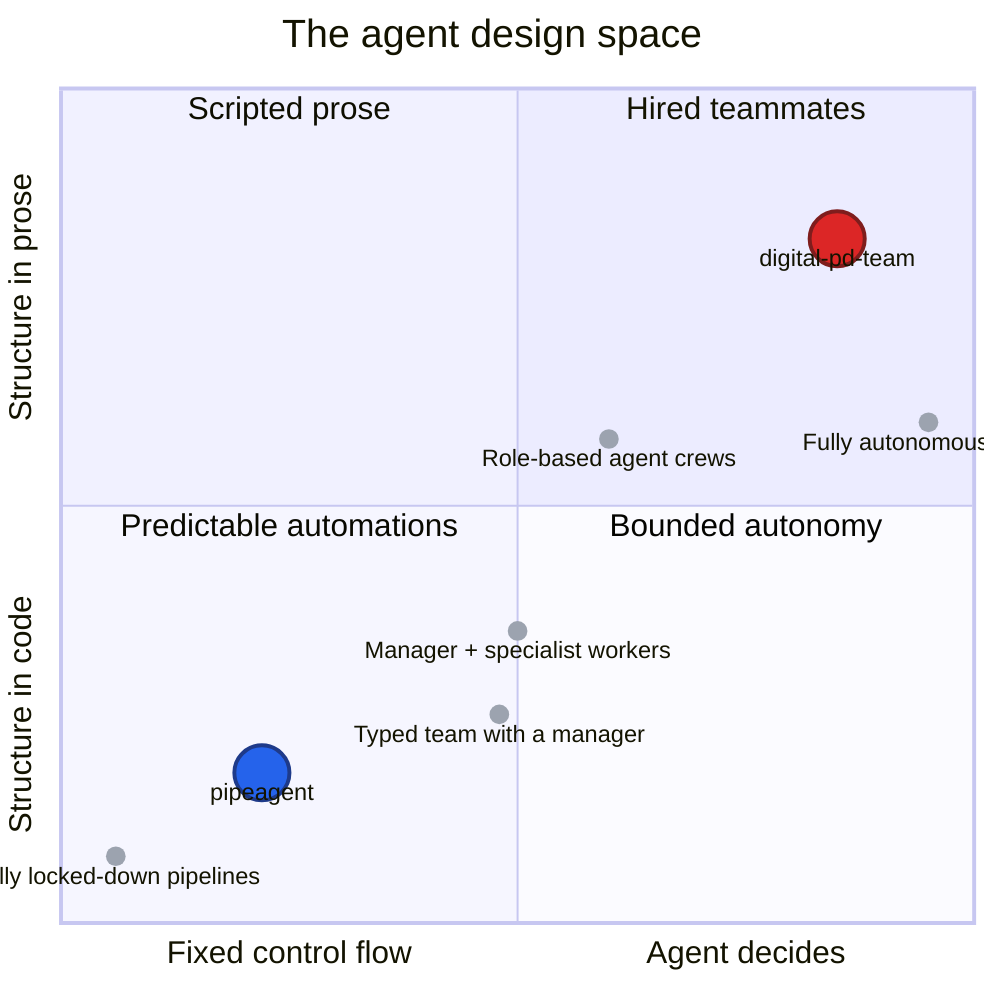

# Agents in the CRM

*What jobs can a CRM agent actually do — and what kind of agent should do each one?*

## Why this document exists

The word "agent" gets used a lot — in roadmap docs, in investor conversations, in product reviews. It means at least three different things depending on who's saying it. This is a personal attempt to fix that, at least for myself, by doing two things:

1. Writing down a **working definition** of what an agent is (and isn't) in the context of a CRM.
2. Walking through the **actual jobs** a CRM agent could do, and proposing *which kind of agent* fits each job.

It's opinionated on purpose. The goal isn't to be comprehensive — it's to give me a concrete claim to argue with (and to share with anyone thinking about the same question).

If you want the engineering deep-dive (architectures, frameworks, code), there's a technical companion piece linked at the bottom. You shouldn't need it to follow this one.

## What is an agent, in a CRM?

A CRM agent is **a piece of software that does CRM work on behalf of a human user, with some ability to decide what to do next without being asked.**

That last clause is the load-bearing one. It's what separates an agent from things it is often confused with:

- **A report** — decides nothing, just shows you numbers.
- **A workflow automation** — decides nothing, just runs the same fixed steps when a trigger fires.
- **A chatbot** — answers questions but doesn't act on the CRM.
- **An LLM behind a button** — generates text only when a human clicks.

An agent, in the sense I mean here, is doing *work* — updating deals, drafting emails, researching companies, scheduling follow-ups — and it has *some* room to choose how to do that work. "Some room" can mean a tiny amount (pick one of three branches) or a large amount (figure it out from scratch). That range is what the rest of this document is about.

Every CRM agent needs two things:

1. **A job** — what work is it doing on behalf of the user?
2. **A decision surface** — what is it allowed to decide for itself, and what's fixed?

The job is a product question. The decision surface is a philosophy question. I'm going to talk about both.

## The jobs worth doing

The pipeagent registry already names six agent roles. They're the concrete jobs this document argues about.

### 1. Lead Qualification
Researches and scores incoming leads against an ideal customer profile. Today: a human reads a form, googles the company, and decides whether to pursue. A good agent does the research automatically, scores against criteria you define, and routes to the right person.
- **Good output:** a cold lead filtered out in seconds; a hot lead handed off with a brief that reads like a peer wrote it.
- **Bad output:** scoring noise, false positives, research so shallow the rep has to redo it.

### 2. Deal Coach
Analyzes the health of an active deal and suggests the next action. Today: sales managers do this in 1:1s — they look at a pipeline, ask "what's stuck and why," and coach. A good agent does this continuously, not weekly.
- **Good output:** *"This deal has been in negotiation 21 days with no customer-initiated touch. The decision-maker hasn't replied in 9 days. Recommend a breakup email."*
- **Bad output:** generic tips that ignore the actual deal context.

### 3. Meeting Prep
Generates a briefing document before a sales call. Today: reps pull up notes, scroll LinkedIn, and skim old emails. A good agent does it in the ten minutes before the call.
- **Good output:** a one-page brief with context, what's changed since last contact, and three specific talking points.
- **Bad output:** a generic company summary that doesn't reference anything real.

### 4. Email Composer
Drafts personalized outreach and follow-ups. Today: the biggest time sink for reps. A good agent drafts in the rep's voice and gives them a one-click send-or-edit.
- **Good output:** an email that sounds like the rep wrote it, references something specific, and has a clear ask.
- **Bad output:** AI-smelling copy with three em-dashes and vague value-prop language.

### 5. Data Enrichment
Auto-fills missing fields on contacts and companies. Today: either manual (slow) or bought from data providers (expensive and stale). A good agent researches on demand and writes back what it finds, with provenance.
- **Good output:** a contact record with current role, recent company news, and an auditable source for every field.
- **Bad output:** plausible-sounding fields that are wrong, with no way to tell which.

### 6. Pipeline Forecaster
Scores deal health and predicts close probability across the whole pipeline. Today: a spreadsheet plus a gut call. A good agent produces a forecast a CFO can live with.
- **Good output:** a per-deal probability that tracks reality better than the rep's stage-based guess.
- **Bad output:** overconfident numbers that swing wildly week-to-week.

These six cover most of the revenue-ops surface area. Notice: they have *very different shapes*. Some are high-volume and repetitive. Some are creative and voice-driven. Some need to be auditable to the decimal place. Some need to be fast and cheap. **This is why one philosophy doesn't fit them all.**

## Two philosophies I've actually built

I have two prototypes. They sit at roughly opposite corners of the design space, and building both taught me more than either one alone would have.

### pipeagent — the engineered pipeline

Think of it as **a pipeline you designed**. For every run, the same steps happen in the same order: fetch the lead, research the company, score it against ICP, write back to the CRM, draft an email, *stop and ask a human to approve before sending*. Every step is predictable. The cost per run is known before you start. A human reviews the output at one specific moment, and the rest is automatic.

It's boring in the good sense. Audit trails are structured. Failures are caught. You can price it per run and forecast monthly spend from volume.

### digital-pd-team — the hired team

Think of it as **a team you hired**. Three bots — Zeno the sales manager, Lux the SDR, Taro the account executive — live in a Telegram group and work for a fictional solar company. They have names, personalities, and job descriptions written in plain English. When a lead comes in, Zeno reads it, posts a message to the group, tags Lux to qualify. Lux does the work and posts back. Taro takes over when the lead is warm. They hand off in natural language. They talk to each other. They talk to the human in the group.

There's no workflow engine. There's no rigid sequence. The coordination layer is a chat group, and the "code" is the job description each bot reads when it wakes up.

It's chaotic in the good sense. It *feels* like managing a team, not running a program. It surprised me with things I didn't design — bots flagging anomalies nobody asked them to check, bots coaching each other through handoffs.

### The one-line contrast

- **pipeagent = agents as *software*.** Deterministic, typed, audit-logged, boring in all the right ways.
- **digital-pd-team = agents as *employees*.** Persistent, conversational, improvisational, a little bit weird.

Both work. They answer different questions. The rest of this document is about which question *each CRM job* is actually asking.

## The tradeoffs you're buying

When you pick a philosophy, you're not picking a vibe — you're buying a specific set of tradeoffs. Here are the six that matter for any product conversation:

**Predictability and cost.** Engineered agents have bounded cost per run. You can forecast monthly spend from volume. Embodied agents are open-ended — a bot might think for three seconds or three minutes per task. You learn to love the model bill.

**Speed of change.** Engineered agents change when engineering ships code. Days per iteration. Embodied agents change when someone edits a job-description document. Minutes per iteration. If the job is still being figured out, this gap matters more than it sounds.

**Observability and trust.** Engineered agents produce audit logs with structured fields — what ran, what it returned, who approved it. Embodied agents produce chat transcripts. Both are legible to humans; only the first is legible to compliance.

**Judgment surface.** How much is the agent allowed to decide? Engineered agents decide *within* the steps you gave them. Embodied agents decide *whether to do anything at all*. More judgment surface means more upside and more ways to be wrong.

**Scale posture.** Engineered agents sleep between triggers and wake when something happens. Embodied agents have a *workday* — they wake themselves up to check on things nobody asked them about. One is a tool. The other is a teammate.

**Failure mode.** When an engineered agent fails, it retries or logs the error and stops. When an embodied agent fails, it messages a human. At small scale this is graceful — you get a polite nudge instead of a cryptic error. At large scale it drowns the human.

## A map of the space

Here's where every option actually sits. The two projects I've built are highlighted; the gray dots are other positions you could stand in.

Two quadrants are where the action is:

- **Bottom-left — predictable automations.** This is pipeagent. The system does the same thing every time. You trust it because it's bounded, auditable, and cheap. Fits jobs that need *consistency*.
- **Top-right — hired teammates.** This is digital-pd-team. The system improvises. You trust it because it talks to you in prose and you can override it in the same chat. Fits jobs that need *judgment* and *voice*.

The middle of the map — manager-plus-specialists, role-based crews — is where most of the industry is currently moving. It blends predictability with judgment: a typed manager decides who runs next, the specialists do the job in a bounded way. I haven't built a prototype there yet, but several of the jobs below might land there.

## Which philosophy for which job?

Here's my opinionated starting point. **The goal isn't to be right — it's to have a concrete claim to argue with.**

| Job | Recommended philosophy | Why |
|---|---|---|
| **Lead Qualification** | Engineered | High volume, repeatable, cost-sensitive. ICP scoring has a clear right answer. Customers want predictability here, not personality. |
| **Data Enrichment** | Engineered | Deterministic, auditable, boring-on-purpose. Mistakes are expensive and visible; every field needs provenance. |
| **Pipeline Forecaster** | Engineered | Numeric, evaluable, needs consistency across quarters. This is the job the CFO will scrutinize most. |
| **Meeting Prep** | Engineered *with one judgment step* | Research-heavy but the output shape is stable. The one thing that benefits from improvisation is *what to look up* — a small judgment surface inside a larger pipeline. |
| **Deal Coach** | Middle ground (manager + specialist) | Structured health scoring (engineered) plus freeform chat with the rep (embodied). This is the clearest case for the middle of the map. |
| **Email Composer** | Embodied (or strong middle) | Voice matters. Drafts need personality. Iteration *is* the product. This is where "AI smell" kills user trust, and embodied agents — the ones with a real persona — are meaningfully less smelly. |
| *(not yet in the registry)* **RevOps Teammate** | Embodied | Judgment-heavy, persistent relationships, needs to notice things nobody asked it to check. If you want to *feel* like you have an AI teammate, this is the job to build it for. Strongest candidate for an embodied pilot. |

A few things this table is claiming on purpose:

1. **Most of the registry is engineered.** Four of the six jobs land in the predictable-automations quadrant. That's a feature, not a failure of imagination. Reliability is the edge for these.
2. **Deal Coach is the interesting one.** It's where the two philosophies genuinely meet, and it's probably where the clearest user-experience wins are hiding.
3. **Email Composer wants a persona.** The risk there isn't correctness — it's taste. Embodied agents handle taste better, because the voice is baked into the identity instead of squeezed into a prompt parameter.
4. **The embodied philosophy deserves a pilot, and the right pilot isn't in the current registry.** A "RevOps Teammate" — not a single job, but a continuous presence that notices and nudges — is where embodied agents shine, and it's a shape the current registry has nothing for.

## Open questions I'm still chewing on

Four questions I don't have clean answers to yet:

1. **Where would I invest first if this were a real product?** A deep engineered pipeline that ships reliably and becomes table stakes, or a pilot embodied teammate that *feels* like a product no competitor has?
2. **What's the edge?** Is the pitch "the most reliable CRM agents in the market" or "the most alive ones"? These need different investments, different storytelling, and different hires.
3. **Which low-risk job is the best place to pilot the other philosophy?** Email Composer is the most defensible middle choice. RevOps Teammate is the most ambitious.
4. **Who owns the judgment surface?** For every embodied agent you ship, someone has to decide how much room it's allowed. That's a product-and-design question, not an engineering one, and it doesn't have a default answer.

---

## Further reading

- **[Two ways to build agents that touch your CRM](./two-ways-to-build-crm-agents.md)** — the engineering companion to this document. Architectures, frameworks, state machines, the whole stack. For anyone who wants the technical receipts.
- The prototypes themselves: **[pipeagent](https://github.com/kristjanelias-xtian/pipeagent)** and **[digital-pd-team](https://github.com/kristjanelias-xtian/digital-pd-team)**.
