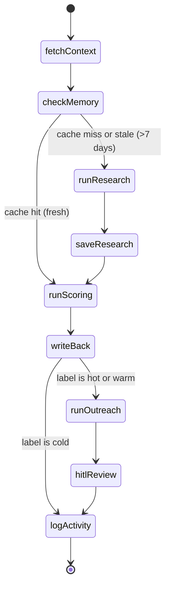
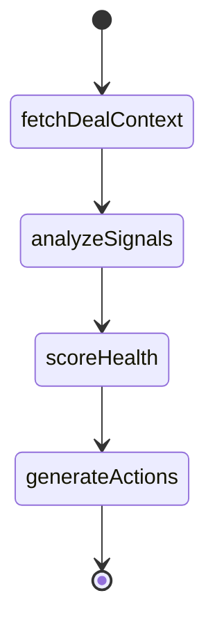

# Architecture Guide

This document explains how PipeAgent works end-to-end — the hub architecture, agent pipelines, data model, and frontend design. It's written for developers joining the project.

## System Overview

PipeAgent is a multi-agent hub for Pipedrive CRM. The hub hosts specialized agents that each operate on a specific Pipedrive data scope (leads, deals, contacts, pipeline). Two agents are currently active:

- **Lead Qualification** — triggered by `lead.added` webhook or manual run, qualifies leads against ICP criteria, drafts outreach emails with human-in-the-loop review
- **Deal Coach** — triggered manually per deal, analyzes deal health by examining activities/notes/participants, scores risk, and suggests actions via an AI chat interface

Four additional agents are registered in the hub as simulated placeholders: Meeting Prep, Email Composer, Data Enrichment, and Pipeline Forecaster.

### Lead Qualification Flow

When a lead is added to Pipedrive, here's what happens:

1. **Trigger** — Pipedrive fires a v2 `lead.create` webhook → hits `POST /webhooks/pipedrive` → if `auto_qualify` config is on, server creates an `agent_run` (status: `running`) and starts the LangGraph pipeline in the background; if off, creates a `pending` run so the frontend knows about the new lead via Supabase Realtime, and the user can manually trigger qualification from the UI
2. **Fetch context** — The agent pulls lead, person, and organization data from Pipedrive's API, plus the agent identity (ICP criteria, personality, rulebook) and company profile from the database
3. **Research** — If no recent research exists for this org (7-day cache), Claude searches the web for company info (size, industry, funding, tech stack, news)
4. **Score** — Claude evaluates the research against the user's ICP criteria, producing a score (0-100) and label (hot/warm/cold)
5. **Write back** — The score and label are written back to the Pipedrive lead, and an HTML note is added with the full scoring breakdown
6. **Outreach** (warm/hot only) — Claude drafts a personalized email based on the research, scoring, and business context
7. **Human review** — The pipeline pauses. The user sees the email draft in the UI and can send, edit, or discard it
8. **Resume** — Once the user acts, the pipeline resumes and logs the final activity

### Deal Coach Flow

When a user selects a deal and triggers analysis:

1. **Fetch context** — Pull deal details, activities, notes, participants, organization, and pipeline stage from Pipedrive; load hub-level global context and agent-level local context from the database
2. **Analyze signals** — Claude analyzes the deal data to extract signals categorized as positive, negative, or warning
3. **Score health** — Calculate a health score (0-100) based on signal ratio, activity recency, and stage staleness
4. **Generate actions** — Suggest 3-5 prioritized actions (email, task, meeting, research) with reasoning
5. **Chat** — User can ask follow-up coaching questions; Claude responds using the cached analysis and conversation history

The frontend shows all of this in realtime via Supabase Realtime subscriptions.

## Agent Implementations

The agent is a LangGraph `StateGraph` defined in `apps/server/src/agent/graph.ts`. It uses PostgreSQL checkpointing so execution can pause at the HITL step and resume later (even after server restarts).

### Lead Qualification Agent

#### State Machine



#### Node Details

| Node | File | What it does |
|------|------|-------------|
| `fetchContext` | `nodes/fetchContext.ts` | Fetches lead, person, org from Pipedrive API. Loads agent identity (config, ICP criteria) from `agent_identity` table and company profile from `company_profile` table. |
| `checkMemory` | `nodes/checkMemory.ts` | Looks up `org_memory` table for cached research. If `last_researched_at` < 7 days ago, sets `memoryFresh = true`. |
| `runResearch` | `graph.ts` (wrapper) | Invokes the research sub-agent. Bridges parent state → sub-agent state. |
| `saveResearch` | `nodes/saveResearch.ts` | Upserts research results into `org_memory` table with current timestamp. |
| `runScoring` | `graph.ts` (wrapper) | Invokes the scoring sub-agent with research data + ICP criteria. |
| `writeBack` | `nodes/writeBack.ts` | Updates Pipedrive lead label (hot/warm/cold). Creates an HTML note with scoring details. Updates `agent_runs` row with score + label. |
| `runOutreach` | `graph.ts` (wrapper) | Invokes the outreach sub-agent. Inserts draft into `email_drafts` table. |
| `hitlReview` | `graph.ts` | Calls LangGraph `interrupt()` — pauses execution and checkpoints state. Sets run status to `paused`. |
| `logActivity` | `nodes/logActivity.ts` | If HITL action is `send`, creates email activity and follow-up activity in Pipedrive. Marks the run as `completed` (or `failed`). |

#### Conditional Routing

Two conditional edges control the flow:

- **`shouldSkipResearch`** — After `checkMemory`: if `state.memoryFresh` is true, skip directly to `runScoring`
- **`shouldSkipOutreach`** — After `writeBack`: if `state.label === 'cold'`, skip to `logActivity` (no email for cold leads)

### Deal Coach Agent

The Deal Coach is a LangGraph `StateGraph` defined in `apps/server/src/agents/deal-coach/graph.ts`. Unlike Lead Qualification, it runs synchronously (no HITL interrupt) and includes a separate chat endpoint.

#### State Machine



#### Node Details

| Node | File | What it does |
|------|------|-------------|
| `fetchDealContext` | `nodes.ts` | Fetches deal, activities, notes, participants, org, and stage from Pipedrive. Loads `hub_config.global_context` and `agent_config.local_context`. |
| `analyzeSignals` | `nodes.ts` | Claude Sonnet analyzes the full deal context and extracts typed signals (positive/negative/warning). |
| `scoreHealth` | `nodes.ts` | Computes health score (0-100) from signal ratio, days since last activity, and days in current stage. |
| `generateActions` | `nodes.ts` | Claude Sonnet suggests 3-5 prioritized actions with reasoning. Upserts results to `deal_analyses` table. |

#### Chat Endpoint

The Deal Coach also provides a chat interface at `POST /deals/:dealId/chat`. This is separate from the LangGraph graph — it uses the cached `deal_analyses` entry plus `deal_chat_messages` history to answer coaching questions about the deal via Claude.

## Sub-agents

(Lead Qualification agent only — Deal Coach uses inline Claude calls in its graph nodes.)

Each sub-agent is a compiled LangGraph subgraph in `apps/server/src/agent/subagents/`. They have their own state annotations and are invoked from wrapper functions in the parent graph.

### Research (`subagents/research.ts`)

Uses the **Anthropic SDK directly** (`@anthropic-ai/sdk`), not LangChain. This is because it needs Anthropic's built-in `web_search` tool (`web_search_20250305`), which isn't available through LangChain.

- Model: `claude-sonnet-4-20250514`
- Max 5 web searches per invocation
- Returns structured `ResearchData`: company description, employee count, industry, funding stage, tech stack, recent news, website URL
- Falls back to raw text summary if JSON parsing fails

### Scoring (`subagents/scoring.ts`)

Uses `@langchain/anthropic` `ChatAnthropic`.

- Receives the research data + ICP criteria array from the user's business profile
- Each ICP criterion is scored individually, then aggregated into an overall score (0-100)
- Maps score to label: hot (≥70), warm (40-69), cold (<40)
- Returns structured `ScoringResult` with per-criterion breakdowns

### Outreach (`subagents/outreach.ts`)

Uses `@langchain/anthropic` `ChatAnthropic`.

- Receives research, scoring, business description, value proposition, and outreach tone
- Generates a personalized email with subject and body
- Only runs for hot/warm leads (cold leads are skipped by the parent graph)

## HITL (Human-in-the-Loop) Flow

The email review flow works across server restarts thanks to LangGraph checkpointing:

1. `runOutreach` generates the email draft and inserts it into `email_drafts` table (status: `pending`)
2. `hitlReview` node calls `interrupt()` — LangGraph checkpoints the full graph state to PostgreSQL and stops execution
3. The run status is set to `paused` in `agent_runs`
4. The frontend picks up the new `email_drafts` row via Supabase Realtime and shows the `EmailDraftBar`
5. User clicks Send / Edit / Discard
6. Frontend calls `POST /chat/resume` with `{ runId, action, editedEmail? }`
7. Server loads the checkpoint, calls `graph.invoke(new Command({ resume: { action, editedEmail } }))` which continues from the interrupt
8. `hitlReview` receives the human response, updates the draft status in the database
9. Execution flows to `logActivity` → pipeline complete

## Data Model

### Tables

```
connections
├── id (UUID, PK)
├── pipedrive_user_id
├── pipedrive_company_id
├── api_domain
├── access_token / refresh_token
└── scopes[]

agent_runs
├── id (UUID, PK)
├── connection_id → connections.id
├── lead_id
├── agent_id (TEXT, default 'lead-qualification')
├── trigger ('webhook' | 'chat' | 'manual')
├── status ('pending' | 'running' | 'paused' | 'completed' | 'failed')
├── graph_state (JSONB)
├── score (integer)
└── label ('hot' | 'warm' | 'cold')

activity_logs                          ← Supabase Realtime enabled
├── id (UUID, PK)
├── run_id → agent_runs.id
├── agent_id (TEXT)
├── node_name
├── event_type
├── payload (JSONB)
└── created_at

org_memory
├── id (UUID, PK)
├── connection_id → connections.id
├── pipedrive_org_id
├── org_name
├── research_data (JSONB)
└── last_researched_at
    UNIQUE(connection_id, pipedrive_org_id)

email_drafts                           ← Supabase Realtime enabled
├── id (UUID, PK)
├── run_id → agent_runs.id
├── subject / body
└── status ('pending' | 'sent' | 'discarded' | 'edited')

agent_identity
├── id (UUID, PK)
├── connection_id → connections.id
├── agent_id (TEXT)
├── name / mission / personality / rulebook (TEXT)
├── config (JSONB) — e.g. LeadQualificationConfig: { icp_criteria, followup_days, auto_qualify }
├── created_at / updated_at
└── UNIQUE(connection_id, agent_id)

company_profile
├── id (UUID, PK)
├── connection_id → connections.id (UNIQUE)
├── name / description
├── service_area / value_proposition
└── notes (TEXT)

business_profiles  (legacy, backfilled into agent_identity)
├── id (UUID, PK)
├── connection_id → connections.id (UNIQUE)
├── business_description
├── value_proposition
├── icp_criteria (JSONB array)
└── outreach_tone

hub_config
├── id (UUID, PK)
├── connection_id → connections.id (UNIQUE)
├── global_context (TEXT)
├── created_at
└── updated_at

agent_config
├── id (UUID, PK)
├── connection_id → connections.id
├── agent_id (TEXT)
├── local_context (TEXT)
├── created_at
├── updated_at
└── UNIQUE(connection_id, agent_id)

deal_analyses
├── id (UUID, PK)
├── connection_id → connections.id
├── pipedrive_deal_id (INTEGER)
├── health_score (INTEGER)
├── signals (JSONB)
├── actions (JSONB)
├── raw_context (JSONB)
├── created_at
├── updated_at
└── UNIQUE(connection_id, pipedrive_deal_id)

deal_chat_messages
├── id (UUID, PK)
├── connection_id → connections.id
├── pipedrive_deal_id (INTEGER)
├── role ('user' | 'assistant')
├── content (TEXT)
└── created_at
```

### Realtime

Supabase Realtime is enabled on `activity_logs`, `agent_runs`, `email_drafts`, `deal_analyses`, and `deal_chat_messages`. The frontend subscribes to channels:
- `logs-{runId}` — new activity log entries (powers the Agent Inspector)
- `runs-{connectionId}` — run status changes (updates lead badges)
- `draft-{runId}` — email draft creation/updates (triggers EmailDraftBar)
- `deal-analysis-{connectionId}` — deal analysis updates (powers Deal Coach workspace)
- `deal-chat-{connectionId}` — new chat messages

## Frontend Architecture

React 19 SPA built with Vite 6 and Tailwind CSS 4. Located in `apps/web/`.

### Layout

```
┌──────────────────────────────────────────────────────────┐
│  TopBar  (logo: "Agent Hub", domain, avatar)             │
├────────┬─────────────────────────────────────────────────┤
│        │                                                 │
│ Side-  │  Content (React Router outlet)                  │
│ bar    │                                                 │
│        │  Home:        Agent grid + recent activity      │
│ • Home │  /agent/:id:  Agent-specific workspace          │
│ • Agents│  /settings:   Global + per-agent config        │
│ • Build │  /build:      Custom agent placeholder         │
│ • Settings│                                              │
│        │                                                 │
└────────┴─────────────────────────────────────────────────┘
```

### Key Components

| Component | File | Purpose |
|-----------|------|---------|
| `HubShell` | `components/HubShell.tsx` | Top-level layout: TopBar + Sidebar + outlet |
| `TopBar` | `components/TopBar.tsx` | Logo, Pipedrive domain, user avatar |
| `Sidebar` | `components/Sidebar.tsx` | Collapsible nav: agents, home, settings, build |
| `Home` | `pages/Home.tsx` | Company profile header (setup prompt when empty), agent grid, simulated agents |
| `Settings` | `pages/Settings.tsx` | Tabs: Business Context (global + per-agent), Connection, Notifications |
| `LoginPage` | `pages/LoginPage.tsx` | OAuth login screen |
| `BuildYourOwn` | `pages/BuildYourOwn.tsx` | Placeholder for custom agent development |
| `Workspace` | `agents/lead-qualification/Workspace.tsx` | Main workspace: IdentityRail + ActivityStream + Verdict panel + InboxStrip |
| `IdentityRail` | `agents/lead-qualification/components/IdentityRail.tsx` | Agent identity card: avatar, role, company link, "Your Shape" (mission, personality, ICP, auto-qualify toggle), edit mode |
| `ActivityStream` | `agents/lead-qualification/components/ActivityStream.tsx` | Realtime pipeline steps with product/technical view toggle; expandable sub-events in technical mode |
| `InboxStrip` | `agents/lead-qualification/components/InboxStrip.tsx` | Horizontal lead inbox with status badges; pending leads shown with amber highlight |
| `EmailDraftBar` | `components/EmailDraftBar.tsx` | Email review with HITL actions (send/edit/discard) |
| `CompanyProfileEditor` | `components/CompanyProfileEditor.tsx` | Modal for editing company profile (name, description, positioning) |
| `DealList` | `agents/deal-coach/DealList.tsx` | Filterable deal cards (All/At Risk/Action Needed) |
| `DealAnalysis` | `agents/deal-coach/DealAnalysis.tsx` | Health score, signals, and action cards |
| `DealChat` | `agents/deal-coach/DealChat.tsx` | Coaching chat with suggested prompts |

### Hooks

| Hook | Purpose |
|------|---------|
| `useConnection` | Auth state, login/logout, JWT token management |
| `useLeads` | Fetch leads from `/leads` endpoint |
| `useDeals` | Fetch deals from `/deals` endpoint |
| `useDealAnalysis` | Trigger analysis, poll results, manage deal chat messages |
| `useSettings` | Fetch/update business profile from `/settings` |
| `useHubConfig` | Fetch/update global context from `/hub-config` |
| `useAgentConfig` | Fetch/update per-agent local context from `/agent-config` |
| `useRecentActivity` | Fetch recent activity logs for the home page |
| `useAgentIdentity` | Fetch/save agent identity (name, mission, personality, config) via `/agent-identity/:agentId`; merges with registry defaults |
| `useCompanyProfile` | Fetch/save company profile via `/company-profile` |
| `useSupabaseRealtime` | Exports `useActivityLogs`, `useAgentRuns`, `useEmailDraft` -- each subscribes to a Supabase Realtime `postgres_changes` channel |

### API Integration

All API calls go through `lib/api.ts` which wraps `fetch` and automatically attaches the JWT `Authorization: Bearer` header from localStorage. `useLeads` polls the Pipedrive API every 30s as a fallback, and also refetches when `useAgentRuns` detects a run for an unknown lead ID (triggered by webhook creating a pending/running run).

## Identity & Config Flow

Agent configuration flows from the UI to the pipeline through two systems:

**Agent Identity** (`agent_identity` table):
1. User configures the agent in the `IdentityRail` sidebar: name, mission, personality, rulebook, ICP criteria, and auto-qualify toggle
2. Saved to `agent_identity` table via `PUT /agent-identity/:agentId` (partial updates are merged with existing row; config is deep-merged)
3. During `fetchContext`, the agent loads identity into state
4. **Scoring sub-agent** receives `identity.config.icp_criteria` -- each criterion is evaluated against the research data
5. **Outreach sub-agent** receives identity personality + company profile for email personalization

**Company Profile** (`company_profile` table):
1. User sets up company info via `CompanyProfileEditor` modal (accessible from Home page and IdentityRail)
2. Loaded during `fetchContext` alongside agent identity
3. Provides shared business context to all agents

Changes take effect on the next agent run without any code changes.

## Webhook Flow

1. During OAuth callback (`/auth/callback`), the server auto-registers a Pipedrive webhook for `lead.create` events pointing to `{WEBHOOK_URL || PUBLIC_SERVER_URL}/webhooks/pipedrive`
2. Pipedrive sends **v2 format** webhooks (lead data in `data` field, not `meta`). App-created webhooks are always v2 and are not visible in the Pipedrive UI (known limitation) -- only via API (`GET /settings/webhooks`)
3. When Pipedrive fires the webhook, the handler at `POST /webhooks/pipedrive`:
   - Extracts lead ID from `data.id` (v2) or `meta.id` (v1 fallback)
   - Looks up the connection by `user_id + company_id`, falling back to `company_id` only (the webhook `user_id` may differ from the OAuth-authenticated user)
   - Checks the agent's `auto_qualify` config flag
   - If `auto_qualify` is on: creates a `running` agent_run and starts the LangGraph pipeline in the background
   - If `auto_qualify` is off: creates a `pending` agent_run (the frontend picks this up via Supabase Realtime and shows the lead with a "Qualify" button)
4. The webhook can also be manually registered via `POST /settings/register-webhook`

## Key Decisions & Trade-offs

**Why LangGraph?** The qualification pipeline needs checkpointing for the HITL email review step. LangGraph's `StateGraph` with PostgreSQL checkpointing handles this natively — the graph pauses at `interrupt()`, checkpoints to Postgres, and can resume hours later (even after server restarts).

**Why Supabase?** Dual purpose — PostgreSQL for data storage + LangGraph checkpointing, and Supabase Realtime for pushing activity updates to the frontend without polling. The service role key gives the server full access; the anon key gives the frontend read-only realtime subscriptions.

**Why Anthropic SDK for research?** The research sub-agent needs Anthropic's built-in `web_search` tool, which is only available through the native `@anthropic-ai/sdk`. The scoring and outreach sub-agents use `@langchain/anthropic` since they don't need web search and benefit from LangChain's structured output helpers.

**Single-service deployment.** The Hono server serves both the API routes and the built React frontend (via static file serving with SPA fallback). This simplifies deployment — one Railway service, one domain, no CORS issues in production.

**Connection-based auth (no Supabase Auth).** Each Pipedrive OAuth flow creates a `connections` row. The frontend stores the `connectionId` in localStorage and sends it as `X-Connection-Id` on every request. This is simple but means auth is tied to the browser — no multi-device sessions. Suitable for an internal/demo tool.

**Org memory caching.** Research results are cached for 7 days in `org_memory` to avoid redundant web searches. If the same organization appears in multiple leads, the cached research is reused. The `checkMemory` node handles this transparently.

**Why a hub?** As PipeAgent grew beyond lead qualification, a hub pattern emerged naturally. Each agent has its own data scope (leads, deals, contacts), pipeline, and workspace, but they share infrastructure: auth, Pipedrive API client, Supabase, and the global context. The hub provides a single entry point and consistent UX across agents.

**Why an agent registry?** The registry (`apps/web/src/agents/registry.ts`) decouples agent metadata from the hub UI. Adding a new agent means: (1) add its metadata to the registry, (2) implement its workspace component, (3) implement its server-side graph. The hub automatically adds it to the sidebar, home grid, and settings. Simulated agents demonstrate the pattern without requiring backend implementation.
