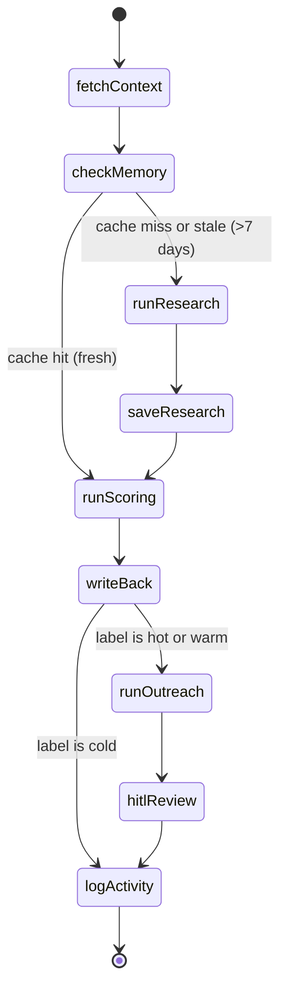

# Architecture Guide

This document explains how PipeAgent works end-to-end — the system flow, agent pipeline, data model, and frontend architecture. It's written for developers joining the project.

## System Overview

When a lead is added to Pipedrive, here's what happens:

1. **Trigger** — Pipedrive fires a `lead.added` webhook → hits `POST /webhooks/pipedrive` → server creates an `agent_run` record and starts the LangGraph pipeline in the background
2. **Fetch context** — The agent pulls lead, person, and organization data from Pipedrive's API, plus the user's business profile (ICP criteria, outreach tone) from the database
3. **Research** — If no recent research exists for this org (7-day cache), Claude searches the web for company info (size, industry, funding, tech stack, news)
4. **Score** — Claude evaluates the research against the user's ICP criteria, producing a score (0-100) and label (hot/warm/cold)
5. **Write back** — The score and label are written back to the Pipedrive lead, and an HTML note is added with the full scoring breakdown
6. **Outreach** (warm/hot only) — Claude drafts a personalized email based on the research, scoring, and business context
7. **Human review** — The pipeline pauses. The user sees the email draft in the UI and can send, edit, or discard it
8. **Resume** — Once the user acts, the pipeline resumes and logs the final activity

The frontend shows all of this in realtime via Supabase Realtime subscriptions.

## Agent Pipeline

The agent is a LangGraph `StateGraph` defined in `apps/server/src/agent/graph.ts`. It uses PostgreSQL checkpointing so execution can pause at the HITL step and resume later (even after server restarts).

### State Machine



### Node Details

| Node | File | What it does |
|------|------|-------------|
| `fetchContext` | `nodes/fetchContext.ts` | Fetches lead, person, org from Pipedrive API. Loads business profile from `business_profiles` table. |
| `checkMemory` | `nodes/checkMemory.ts` | Looks up `org_memory` table for cached research. If `last_researched_at` < 7 days ago, sets `memoryFresh = true`. |
| `runResearch` | `graph.ts` (wrapper) | Invokes the research sub-agent. Bridges parent state → sub-agent state. |
| `saveResearch` | `nodes/saveResearch.ts` | Upserts research results into `org_memory` table with current timestamp. |
| `runScoring` | `graph.ts` (wrapper) | Invokes the scoring sub-agent with research data + ICP criteria. |
| `writeBack` | `nodes/writeBack.ts` | Updates Pipedrive lead label (hot/warm/cold). Creates an HTML note with scoring details. Updates `agent_runs` row with score + label. |
| `runOutreach` | `graph.ts` (wrapper) | Invokes the outreach sub-agent. Inserts draft into `email_drafts` table. |
| `hitlReview` | `graph.ts` | Calls LangGraph `interrupt()` — pauses execution and checkpoints state. Sets run status to `paused`. |
| `logActivity` | `nodes/logActivity.ts` | Marks the run as `completed` (or `failed`). |

### Conditional Routing

Two conditional edges control the flow:

- **`shouldSkipResearch`** — After `checkMemory`: if `state.memoryFresh` is true, skip directly to `runScoring`
- **`shouldSkipOutreach`** — After `writeBack`: if `state.label === 'cold'`, skip to `logActivity` (no email for cold leads)

## Sub-agents

Each sub-agent is a compiled LangGraph subgraph in `apps/server/src/agent/subagents/`. They have their own state annotations and are invoked from wrapper functions in the parent graph.

### Research (`subagents/research.ts`)

Uses the **Anthropic SDK directly** (`@anthropic-ai/sdk`), not LangChain. This is because it needs Anthropic's built-in `web_search` tool (`web_search_20250305`), which isn't available through LangChain.

- Model: `claude-sonnet-4-20250514`
- Max 5 web searches per invocation
- Returns structured `ResearchData`: company description, employee count, industry, funding stage, tech stack, recent news, website URL
- Falls back to raw text summary if JSON parsing fails

### Scoring (`subagents/scoring.ts`)

Uses `@langchain/anthropic` `ChatAnthropic`.

- Receives the research data + ICP criteria array from the user's business profile
- Each ICP criterion is scored individually, then aggregated into an overall score (0-100)
- Maps score to label: hot (≥70), warm (40-69), cold (<40)
- Returns structured `ScoringResult` with per-criterion breakdowns

### Outreach (`subagents/outreach.ts`)

Uses `@langchain/anthropic` `ChatAnthropic`.

- Receives research, scoring, business description, value proposition, and outreach tone
- Generates a personalized email with subject and body
- Only runs for hot/warm leads (cold leads are skipped by the parent graph)

## HITL (Human-in-the-Loop) Flow

The email review flow works across server restarts thanks to LangGraph checkpointing:

1. `runOutreach` generates the email draft and inserts it into `email_drafts` table (status: `pending`)
2. `hitlReview` node calls `interrupt()` — LangGraph checkpoints the full graph state to PostgreSQL and stops execution
3. The run status is set to `paused` in `agent_runs`
4. The frontend picks up the new `email_drafts` row via Supabase Realtime and shows the `EmailDraftBar`
5. User clicks Send / Edit / Discard
6. Frontend calls `POST /chat/resume` with `{ runId, action, editedEmail? }`
7. Server loads the checkpoint, calls `graph.invoke(new Command({ resume: { action, editedEmail } }))` which continues from the interrupt
8. `hitlReview` receives the human response, updates the draft status in the database
9. Execution flows to `logActivity` → pipeline complete

## Data Model

### Tables

```
connections
├── id (UUID, PK)
├── pipedrive_user_id
├── pipedrive_company_id
├── api_domain
├── access_token / refresh_token
└── scopes[]

agent_runs
├── id (UUID, PK)
├── connection_id → connections.id
├── lead_id
├── trigger ('webhook' | 'chat' | 'manual')
├── status ('running' | 'paused' | 'completed' | 'failed')
├── graph_state (JSONB)
├── score (integer)
└── label ('hot' | 'warm' | 'cold')

activity_logs                          ← Supabase Realtime enabled
├── id (UUID, PK)
├── run_id → agent_runs.id
├── node_name
├── event_type
├── payload (JSONB)
└── created_at

org_memory
├── id (UUID, PK)
├── connection_id → connections.id
├── pipedrive_org_id
├── org_name
├── research_data (JSONB)
└── last_researched_at
    UNIQUE(connection_id, pipedrive_org_id)

email_drafts                           ← Supabase Realtime enabled
├── id (UUID, PK)
├── run_id → agent_runs.id
├── subject / body
└── status ('pending' | 'sent' | 'discarded' | 'edited')

business_profiles
├── id (UUID, PK)
├── connection_id → connections.id (UNIQUE)
├── business_description
├── value_proposition
├── icp_criteria (JSONB array)
└── outreach_tone
```

### Realtime

Supabase Realtime is enabled on `activity_logs`, `agent_runs`, and `email_drafts`. The frontend subscribes to channels:
- `logs-{runId}` — new activity log entries (powers the Agent Inspector)
- `runs-{connectionId}` — run status changes (updates lead badges)
- `draft-{runId}` — email draft creation/updates (triggers EmailDraftBar)

## Frontend Architecture

React 19 SPA built with Vite 6 and Tailwind CSS 4. Located in `apps/web/`.

### Layout

```
┌─────────────┬─────────────────────┬──────────────┐
│  LeadsList  │   AgentInspector    │  ChatPanel   │
│  (left)     │   (center)          │  (right)     │
│             │                     │              │
│  • Lead     │   • Activity log    │  • Messages  │
│    cards    │     entries         │  • Run       │
│  • Score    │   • Node names      │    button    │
│    badges   │   • Timestamps      │              │
│  • Select   │                     │              │
│    + run    │                     │              │
├─────────────┴─────────────────────┴──────────────┤
│  EmailDraftBar (bottom, shown when draft exists) │
│  • Subject + body preview                        │
│  • Send / Edit / Discard buttons                 │
└──────────────────────────────────────────────────┘

         SettingsPanel (modal overlay)
```

### Key Components

| Component | File | Purpose |
|-----------|------|---------|
| `App` | `App.tsx` | Root layout, state management, orchestration |
| `LoginScreen` | `LoginScreen.tsx` | OAuth login (shown when no `connectionId`) |
| `LeadsList` | `LeadsList.tsx` | Lead cards with score badges, run triggers |
| `AgentInspector` | `AgentInspector.tsx` | Realtime activity log viewer |
| `ChatPanel` | `ChatPanel.tsx` | Agent messages and action controls |
| `EmailDraftBar` | `EmailDraftBar.tsx` | Email review with HITL actions |
| `SettingsPanel` | `SettingsPanel.tsx` | Business profile + ICP criteria editor |

### Hooks

| Hook | Purpose |
|------|---------|
| `useConnection` | Auth state, login/logout, connectionId from localStorage |
| `useLeads` | Fetch leads from `/leads` endpoint |
| `useSettings` | Fetch/update business profile from `/settings` |
| `useSupabaseRealtime` | Exports `useActivityLogs`, `useAgentRuns`, `useEmailDraft` — each subscribes to a Supabase Realtime channel |

### API Integration

All API calls go through `lib/api.ts` which wraps `fetch` and automatically attaches the `X-Connection-Id` header from localStorage. The connection ID is the sole auth boundary — there is no Supabase Auth.

## Settings & ICP Flow

The business profile flows from the settings UI to the agent pipeline:

1. User configures their profile in `SettingsPanel`: business description, value proposition, ICP criteria (array of `{ name, description, weight }`), and outreach tone
2. Saved to `business_profiles` table via `PUT /settings`
3. During `fetchContext`, the agent loads the business profile into state as `settings`
4. **Scoring sub-agent** receives `settings.icp_criteria` — each criterion is evaluated against the research data
5. **Outreach sub-agent** receives `settings.business_description`, `settings.value_proposition`, and `settings.outreach_tone` — used to personalize the email draft

This means changing your ICP criteria or outreach tone takes effect on the next agent run without any code changes.

## Webhook Flow

1. During OAuth callback (`/auth/callback`), the server auto-registers a Pipedrive webhook for `lead.added` events pointing to `{WEBHOOK_URL || PUBLIC_SERVER_URL}/webhooks/pipedrive`
2. When Pipedrive fires the webhook, the handler at `POST /webhooks/pipedrive`:
   - Validates the event type is `added` and entity is `lead`
   - Looks up the connection by matching Pipedrive company domain
   - Creates a new `agent_run` record
   - Starts the qualification pipeline in the background (non-blocking response)
3. The webhook can also be manually registered via `POST /settings/register-webhook`

## Key Decisions & Trade-offs

**Why LangGraph?** The qualification pipeline needs checkpointing for the HITL email review step. LangGraph's `StateGraph` with PostgreSQL checkpointing handles this natively — the graph pauses at `interrupt()`, checkpoints to Postgres, and can resume hours later (even after server restarts).

**Why Supabase?** Dual purpose — PostgreSQL for data storage + LangGraph checkpointing, and Supabase Realtime for pushing activity updates to the frontend without polling. The service role key gives the server full access; the anon key gives the frontend read-only realtime subscriptions.

**Why Anthropic SDK for research?** The research sub-agent needs Anthropic's built-in `web_search` tool, which is only available through the native `@anthropic-ai/sdk`. The scoring and outreach sub-agents use `@langchain/anthropic` since they don't need web search and benefit from LangChain's structured output helpers.

**Single-service deployment.** The Hono server serves both the API routes and the built React frontend (via static file serving with SPA fallback). This simplifies deployment — one Railway service, one domain, no CORS issues in production.

**Connection-based auth (no Supabase Auth).** Each Pipedrive OAuth flow creates a `connections` row. The frontend stores the `connectionId` in localStorage and sends it as `X-Connection-Id` on every request. This is simple but means auth is tied to the browser — no multi-device sessions. Suitable for an internal/demo tool.

**Org memory caching.** Research results are cached for 7 days in `org_memory` to avoid redundant web searches. If the same organization appears in multiple leads, the cached research is reused. The `checkMemory` node handles this transparently.
